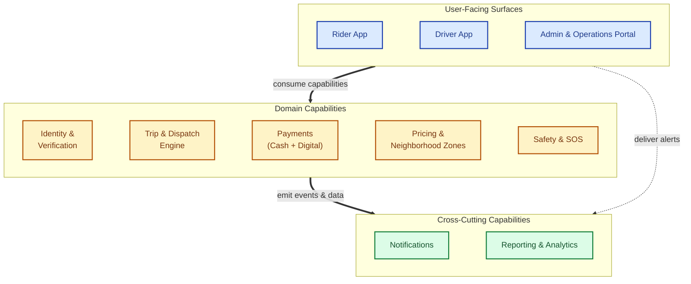
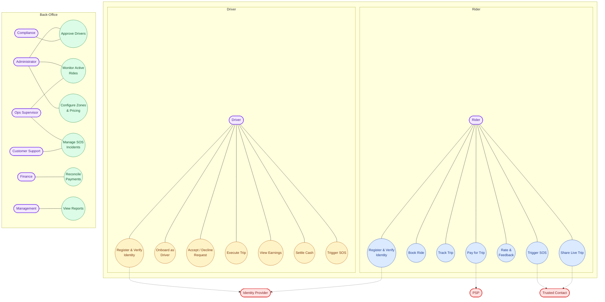
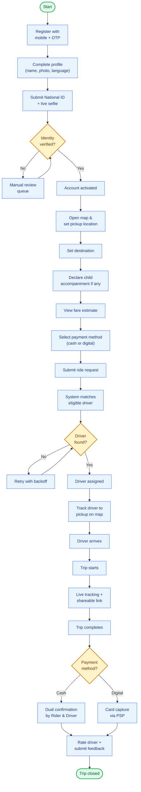
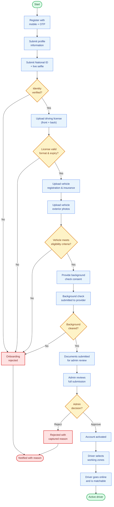
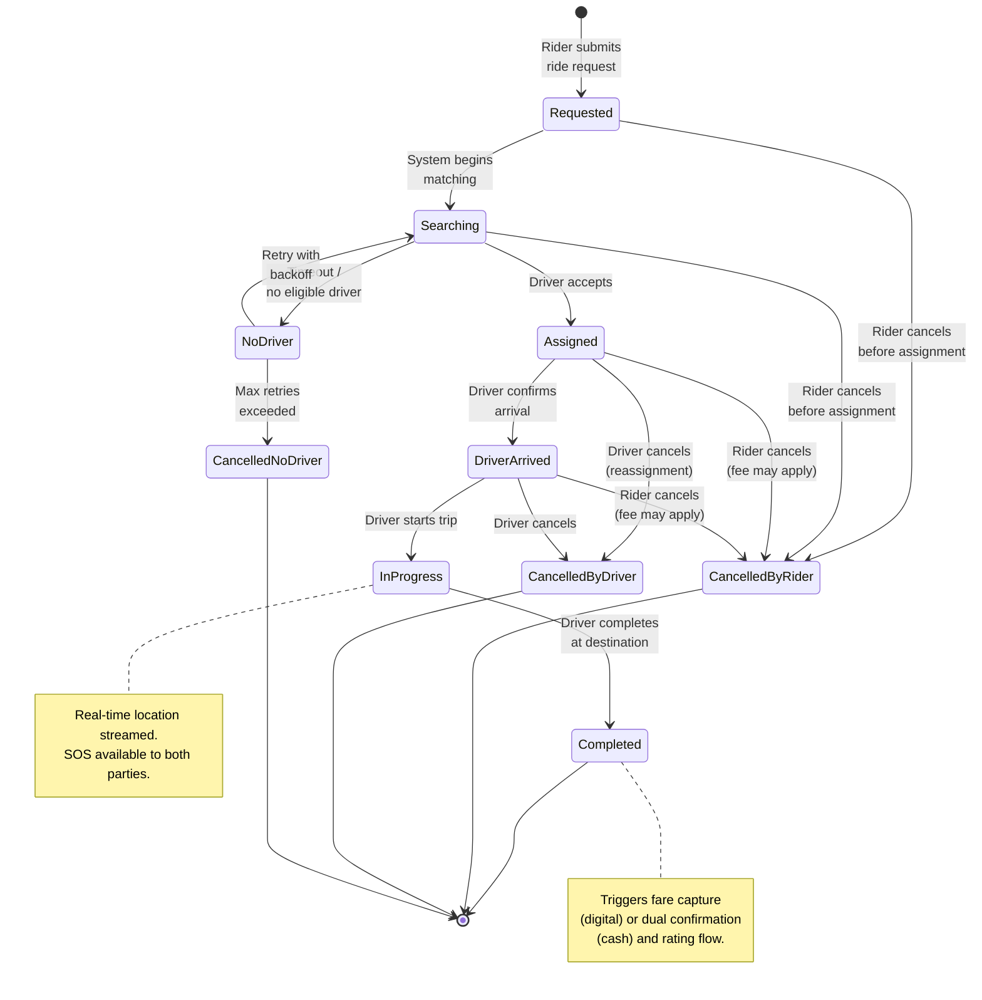
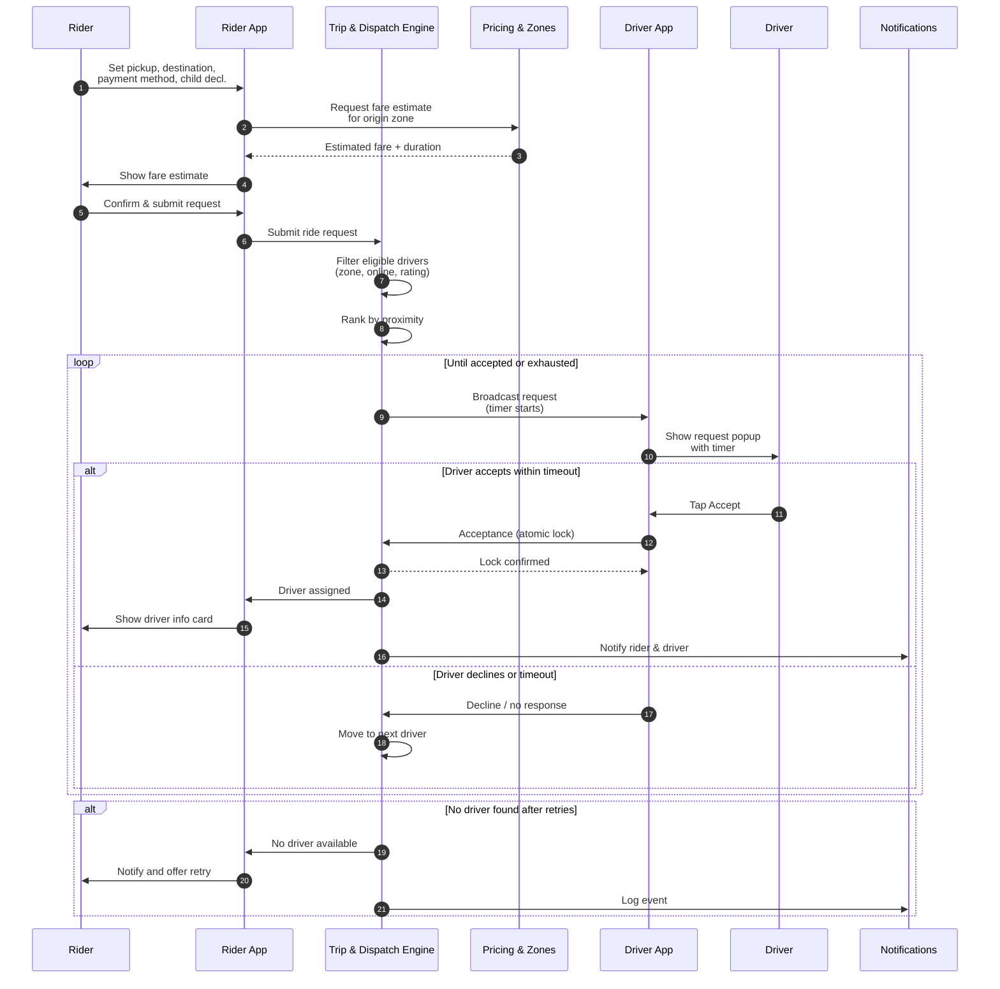
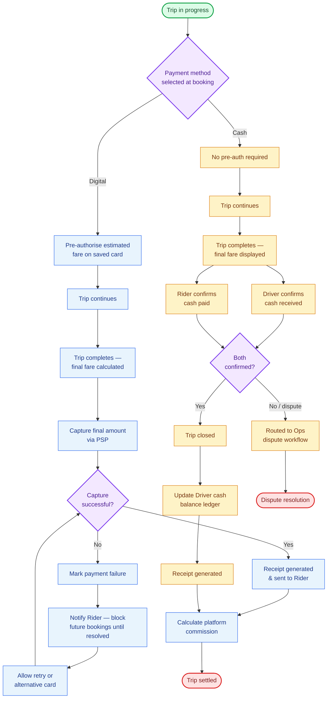
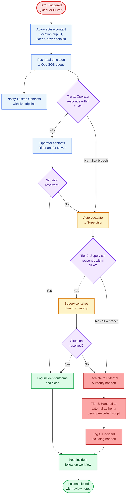

# 10. Diagrams

This section provides visual representations of the platform's architecture, primary user journeys, key business processes, and operational workflows. Each diagram complements — and does not replace — the textual specifications provided in earlier sections of this document. Where a diagram and the surrounding text appear to differ, the textual specifications and functional requirements (Section 7) take precedence.

The diagrams are organised as follows:

- **10.1 Module Interaction Diagram** — High-level view of the ten platform modules and how they relate across layers.
- **10.2 Use Case Diagram** — Primary actors and their core use cases, grouped by user type.
- **10.3 Rider Journey Flow** — End-to-end Rider experience from registration through trip completion.
- **10.4 Driver Onboarding Flow** — Driver journey from registration through approval and activation.
- **10.5 Trip Lifecycle State Diagram** — Valid trip states and transitions.
- **10.6 Dispatch & Matching Sequence** — Sequence of interactions during ride matching.
- **10.7 Payment Flow (Cash + Digital)** — Side-by-side handling of cash and digital payment rails.
- **10.8 SOS Escalation Flow** — Multi-tier escalation workflow with SLA gates.

All diagrams are maintained as Mermaid source alongside this document. To update any diagram, edit the Mermaid source block, re-render to PNG (e.g., via [mermaid.live](https://mermaid.live) or a local Mermaid CLI), and replace the corresponding image in the Word document.

---

## 10.1 Module Interaction Diagram

This diagram presents the SheDrive platform as three logical layers: User-Facing Surfaces (the apps and portal), Domain Capabilities (the business engines), and Cross-Cutting Capabilities (services that support all modules). User-facing surfaces consume the domain capabilities; domain capabilities emit events and data into the cross-cutting layer; and notifications also flow directly back to the user-facing surfaces.

This view aligns with the module structure defined in Section 6.1 and the interaction narrative in Section 6.3.

**Image:** `10-1-module-interaction.png`

**Mermaid source:**

---

## 10.2 Use Case Diagram

This diagram organises the primary use cases of the SheDrive platform around three actor groups: Rider, Driver, and Back-Office users. Each use case is associated with the actor or actors who initiate it. External actors — Trusted Contacts, the Payment Service Provider, and the Identity Verification Provider — are shown with dashed connections to indicate that they participate in but do not initiate the corresponding use cases.

The use cases shown are illustrative of the platform's primary functional surface and are detailed exhaustively in Section 7. Some use cases (e.g., Register & Verify Identity, Trigger SOS) are reachable by both Rider and Driver actors and are shown in both swim-lanes.

**Image:** `10-2-use-cases.png`

**Mermaid source:**

---

## 10.3 Rider Journey Flow

This diagram presents the end-to-end experience of a Rider from initial registration through trip completion. It covers the three logical phases of the Rider experience: account creation and identity verification, booking and matching, and trip execution and settlement. Diamond-shaped nodes mark decision points (identity verification outcome, driver availability, payment method); rectangular nodes represent process steps.

The flow assumes a verified Rider operating within the platform's defined operating hours and within a configured neighborhood zone. Edge cases — payment failure, no driver available after retries, manual review queue — are visualised.

**Image:** `10-3-rider-journey.png`

**Mermaid source:**

---

## 10.4 Driver Onboarding Flow

This diagram covers the multi-stage Driver onboarding sequence: mobile registration, identity verification, driving license validation, vehicle document and photo submission, vehicle eligibility check, background check consent and clearance, and final administrative review. Any failed gate routes the Driver to onboarding rejection with a captured reason; only approved Drivers are activated and may select working zones to become matchable.

This flow reflects the requirements in Section 7.2 (Driver App) and Section 7.4 (Identity & Verification), plus the administrative review behaviours defined in Section 7.3.

**Image:** `10-4-driver-onboarding.png`

**Mermaid source:**

---

## 10.5 Trip Lifecycle State Diagram

This diagram captures the valid trip states enforced by the Trip & Dispatch Engine (TD-007) and the legal transitions between them. A trip enters the "Requested" state when the Rider submits a ride request, progresses through matching, assignment, arrival, in-progress, and completion, or terminates in one of three cancellation states (cancelled by Rider, cancelled by Driver, or cancelled because no Driver was available).

Cancellation policy and applicable fees vary by zone configuration (Section 7.7) and trip state at the time of cancellation. Real-time location streaming and SOS availability apply during the In-Progress state. Trip completion triggers fare capture (digital) or dual cash confirmation (cash) and the rating flow.

**Image:** `10-5-trip-lifecycle.png`

**Mermaid source:**

---

## 10.6 Dispatch & Matching Sequence

This diagram presents the sequence of interactions during ride matching, from the Rider's initial request submission through Driver assignment (or the no-driver-available case). It is intentionally aligned with the requirements in Section 7.6 (Trip & Dispatch Engine), including the broadcast-with-timeout pattern (TD-003), atomic acceptance (TD-004), decline/timeout reassignment (TD-005), and the no-driver-available retry queue (TD-010).

The Pricing & Neighborhood Zones module is consulted at fare-estimate time. The Notifications module is invoked at lifecycle transitions to keep both parties informed.

**Image:** `10-6-dispatch-sequence.png`

**Mermaid source:**

---

## 10.7 Payment Flow (Cash + Digital)

This diagram presents the two payment rails side-by-side. The Digital path uses pre-authorisation at trip start and capture at trip completion via the configured PSP, with explicit handling for capture failure (rider notified, future bookings blocked until resolved). The Cash path requires dual confirmation from both Rider and Driver at trip completion; mismatched confirmation routes the trip to the Operations dispute workflow. Both rails culminate in commission calculation and trip settlement.

This flow reflects the requirements in Section 7.5 (Payments). Refund handling and reconciliation views are managed through the Admin & Operations Portal (Section 7.3).

**Image:** `10-7-payment-flow.png`

**Mermaid source:**

---

## 10.8 SOS Escalation Flow

This diagram presents the three-tier SOS escalation workflow operationalised by the Safety & SOS module (Section 7.8). When SOS is triggered by either a Rider or a Driver during an active trip, the system auto-captures contextual data, alerts the Operations queue in real time, and notifies any configured Trusted Contacts with a live trip link. Tier 1 (operator), Tier 2 (supervisor), and Tier 3 (external authority handoff) are gated by SLA windows; failure to respond within an SLA, or unresolved situations, drive automatic escalation to the next tier. All incidents are logged, with a post-incident follow-up workflow supporting outcome capture and review notes.

The SLA durations themselves are platform parameters configured via the System Parameters Management capability described in Section 7.3.1.

**Image:** `10-8-sos-escalation.png`

**Mermaid source:**

---

## How to update these diagrams

Each diagram above is rendered from a single Mermaid code block. To update any diagram:

1. Edit the Mermaid source block for the relevant diagram (e.g., to add a node, change a label, adjust a connection).
2. Re-render the diagram to PNG using one of the following:
   - **Online:** paste the code block into [https://mermaid.live](https://mermaid.live) and download the PNG.
   - **Local CLI:** `mmdc -i diagram.mmd -o diagram.png -b white --scale 2`.
   - **VS Code:** install the "Markdown Preview Mermaid Support" extension and export from the preview.
3. Replace the corresponding image in the Word document.
4. Check the descriptive paragraph above the diagram for any text that also needs updating.

Mermaid syntax reference: [https://mermaid.js.org/intro/](https://mermaid.js.org/intro/)
